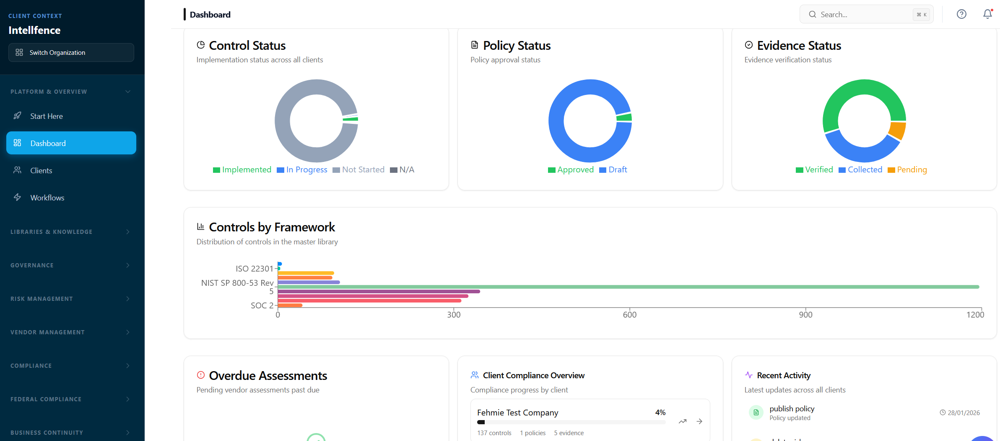
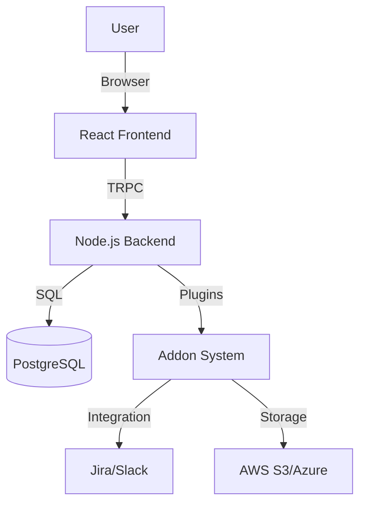

# GRCompliance

<div align="center">



**The Open Source Operating System for Governance, Risk, and Compliance.**

[](https://www.gnu.org/licenses/agpl-3.0)
[](https://github.com/sectutor/ComplianceOS/actions/workflows/ci.yml)
[](https://www.typescriptlang.org/)
[](https://reactjs.org/)
[](http://makeapullrequest.com)

[Features](#-key-features) • [Why GRCompliance?](#-why-grcompliance) • [Getting Started](#-getting-started) • [Architecture](#-architecture) • [Contributing](#-contributing)

</div>

---

## 🚀 Overview

**GRCompliance** is a comprehensive, open-source GRC (Governance, Risk, and Compliance) platform designed to democratize security compliance. It replaces fragmented spreadsheets and expensive enterprise tools with a modern, unified operating system for security teams.

Whether you are a startup aiming for **SOC 2 Type I** or an enterprise managing complex **ISO 27001** and **GDPR** frameworks, GRCompliance provides the primitives to build, manage, and automate your compliance program.

## ✨ Key Features

### 🛡️ Unified Control Framework
Define your controls once and map them to multiple standards automatically.
- **Multi-Framework Support**: Built-in support for ISO 27001, SOC 2, HIPAA, PCI-DSS, NIST 800-53, and GDPR.
- **Smart Mapping**: Our "Mesh" architecture ensures that one implemented control satisfies requirements across multiple frameworks.
- **Harmonization**: Automatically identify overlapping requirements to reduce audit fatigue.

### 📊 Automated Risk Management
Move beyond static risk registers with a dynamic, ISO 31000-aligned risk engine.
- **Visual Heatmaps**: Real-time visualization of your risk landscape.
- **Asset-Based Risk**: Link risks directly to your assets, vendors, and processes.
- **Treatment Plans**: Track remediation tasks and accept, transfer, or mitigate risks with audit trails.

### 🔌 Modular Addon System
Extensible architecture allowing you to connect your favorite tools.
- **Integrations**: Connect Jira, Slack, GitHub, and more.
- **Storage Providers**: Bring your own storage (AWS S3, Azure Blob, Google Cloud).
- **Templates**: Marketplace for policy packs and assessment templates.
- **Developer Friendly**: easy-to-use API for building your own [Custom Addons](./docs/ADDON_SYSTEM.md).

### 🏢 Business Continuity & Disaster Recovery
Built-in tools to keep your business running during disruptions.
- **BIA (Business Impact Analysis)**: Calculate RTOs and RPOs with guided workflows.
- **Recovery Plans**: Create and test actionable disaster recovery plans.
- **Call Trees**: Manage emergency contacts and communication protocols.

### 🔍 Audit Hub
Streamline your external audits.
- **Evidence Collection**: Centralized repository for all compliance evidence.
- **Auditor Access**: specific views for auditors to review controls without accessing sensitive internal data.
- **Snapshotting**: "Freeze" your compliance state for point-in-time audits.

### 🔒 Privacy Center
Manage your data privacy obligations in one place.
- **ROPA**: Record of Processing Activities generator.
- **DSAR Management**: Workflow for handling Data Subject Access Requests.
- **DPIA**: Data Protection Impact Assessments for high-risk processing.

### 🏛️ Federal & Government Compliance
Dedicated tools for defense contractors and federal agencies.
- **NIST 800-171 / CMMC**: Specialized workflows for CMMC readiness.
- **SSP Editor**: Generator for System Security Plans.
- **POAM Tracker**: Plan of Action and Milestones tracking for federal audits.
- **FIPS 199**: Categorization wizard for federal information systems.

### 🤝 Third-Party Risk Management (TPRM)
End-to-end vendor risk lifecycle management.
- **Vendor Onboarding**: Workflows for assessing and onboarding new vendors.
- **Security Reviews**: Automated questionnaires and risk scoring.
- **Contract Management**: Track DPAs (Data Processing Agreements) and security addendums.
- **Vendor Catalog**: Centralized database of all third-party suppliers.

### 🛡️ Cyber Resilience
Prepare for and respond to cyber incidents.
- **Incident Reporting**: Centralized logging and tracking of security incidents.
- **Cyber Assessments**: Regular maturity assessments against cyber frameworks.


## ⚖️ Core vs Enterprise
GRCompliance operates on an **Open Core** model. We believe security should be accessible to everyone, but advanced automation and specialized frameworks require sustained development.

| Feature | 🟢 Community (Core) | 💎 Enterprise (Premium) |
| :--- | :---: | :---: |
| **Frameworks** | ISO 27001, SOC 2, HIPAA, GDPR | **+ FedRAMP, CMMC, NIST 800-53** |
| **Risk Management** | ISO 31000 Risk Engine | **+ Threat Intelligence, AI Analysis** |
| **Multi-Tenancy** | Single Workspace | **Unlimited Workspaces (MSP Mode)** |
| **Automation** | Standard Evidence Collection | **Advanced API Integrations** |
| **Support** | Community via GitHub | **SLA + Dedicated Success Manager** |
| **Release Cycle** | Stable Quarterly Releases | **Continuous "Edge" Updates** |

### 🎓 The "Feature Graduation" Philosophy
We use a time-delayed open source model. New, cutting-edge features (like AI Governance or new Federal standards) are initially released to **Premium** users to fund development. After a stabilization period (typically 3-6 months), these features are "graduated" into the **Community** edition, ensuring the open source platform gets more powerful over time.

## 🏆 Why GRCompliance?

| Metric | 🚀 GRCompliance | 📉 Spreadsheets | 🏢 Commercial (Vanta/Drata) |
| :--- | :---: | :---: | :---: |
| **Cost** | **Free (Self-Hosted)** | Free | $15,000+ / year |
| **Data Privacy** | **On-Prem / Private Cloud** | Local Files | Third-Party SaaS |
| **Customization** | **Full Code Access** | High | Rigid |
| **Vendor Lock-in** | **None (Open Data)** | None | High |
| **Speed** | **Instant Setup** | Manual | Weeks of Sales Calls |

## 🏗️ Architecture



## 🛠️ Tech Stack

GRCompliance is built with a modern, type-safe stack designed for performance and developer experience.

- **Frontend**: React 18, TypeScript, Tailwind CSS, Shadcn UI
- **Backend**: Node.js, Express
- **API**: TRPC (End-to-end type safety)
- **Database**: PostgreSQL
- **ORM**: Drizzle ORM
- **Authentication**: JWT / OAuth2

## 🚀 Getting Started

### Docker (Recommended) — One Command

```bash
curl -fsSL https://grcompliance.com/install.sh | bash
```

This clones the repo, builds the image, and starts PostgreSQL + Redis + ComplianceOS on port 3002.

**Visit http://localhost:3002** to log in. Local auth is seeded on first boot:
- Email: `admin@complianceos.local`
- Password: the value of `COMPLIANCE_ADMIN_PASSWORD`, or a random password generated and **printed once in the server startup log** (look for the `🔑 Admin login:` box). Set `COMPLIANCE_ADMIN_EMAIL` to override the email.

> Supabase is optional — local auth works out of the box for self-hosted deployments.

### Manual Setup (Development)

| Prerequisite  | Version   |
|---------------|-----------|
| Node.js       | 20+       |
| PostgreSQL    | 15+       |

```bash
# Clone
git clone https://github.com/sectutor/ComplianceOS.git
cd ComplianceOS

# Install
npm install

# Configure
cp .env.example .env
# Edit .env: set DATABASE_URL and PORT (default 3002; this repo's dev setup uses 3005)

# Initialize database schema
npm run db:push

# Start both servers (frontend on 5173, API on your PORT):
npm run dev:full
# ...or run them separately:
npm run dev        # Vite frontend  -> http://localhost:5173
npm run server     # API backend    -> http://localhost:<PORT>
```

Visit `http://localhost:5173` to start using GRCompliance. With local auth
(`AUTH_MODE=local`), the first boot seeds `admin@complianceos.local` and prints
the generated password in the server log — see the note above.

> **Note:** the API server does **not** hot-reload. After editing backend files,
> restart `npm run server`.

### Production Deployment (canonical path)

Docker is the supported deployment: use `install.sh` (or `docker-compose.yml`)
as described above — it builds the image and runs PostgreSQL + Redis +
ComplianceOS as a single stack. Other deployment artifacts in the repo
(Netlify, Vercel, Helm, Tauri) are community contributions and not part of the
tested release path.

## 📚 Documentation

Detailed documentation is available in the [`docs/`](./docs) directory:

- [**Addon Development Guide**](./docs/ADDON_SYSTEM.md)
- [**Strategic Differentiators**](./docs/STRATEGIC_DIFFERENTIATORS.md)
- [**Architecture Overview**](./docs/architecture.md)
- [**API Reference**](./docs/api-reference.md)
- [**Database Schema**](./docs/database-schema.md)

## 🤝 Contributing

We welcome contributions from the community! Whether it's fixing bugs, adding new frameworks, or building addons, your help is appreciated.

Please read our [Contributing Guide](./CONTRIBUTING.md) to get started.

## 📄 License

ComplianceOS uses a dual-licensing model:

### Community Edition (AGPLv3)
The core ComplianceOS platform is licensed under the **GNU Affero General Public License v3.0 (AGPLv3)**. This allows you to:
- Use, modify, and distribute the software for free
- Self-host for personal or business use
- Contribute improvements back to the community

**Important**: The AGPLv3 requires that if you modify the software and make it available as a network service, you must make your modifications available under the same license.

### Enterprise Edition (Commercial)
For organizations requiring advanced features, enterprise support, or commercial use rights, we offer a **Commercial License** that includes:
- AI-Powered Intelligence Suite
- Advisor & MSP Features (white-labeling)
- Enterprise Scalability
- Professional Support & SLA
- Commercial use rights

For commercial licensing inquiries, please contact us at [sales@complianceos.com](mailto:sales@complianceos.com).

### License Files
- [AGPLv3 License](./LICENSE) - Community Edition
- [Commercial License Template](./LICENSE-COMMERCIAL.md) - Enterprise Edition

---

<div align="center">
  Built with ❤️ by the Open Source Security Community
</div>
