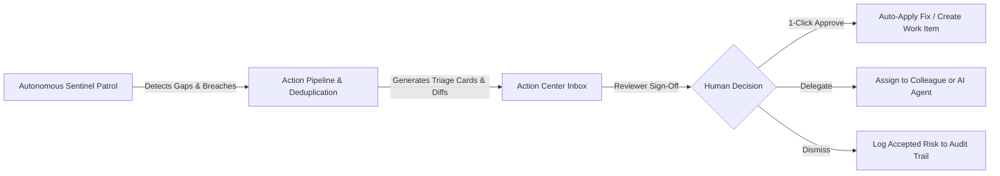

# ComplianceOS Proactive Action Center — User & Operator Guide

> **Version:** 2.0 Enterprise  
> **Audience:** Compliance Officers, CISOs, SecOps Engineers, Internal Auditors, and Executive Reviewers.

---

## 1. Executive Summary

Traditional compliance platforms are **passive databases**: they wait for human operators to remember audit deadlines, notice that policies are outdated, or manually cross-reference new vulnerabilities against remediation SLAs.

The **ComplianceOS Proactive Action Center** changes this paradigm by running a continuous, autonomous **Sentinel Fleet** in the background. The sentinels actively monitor your compliance posture, detect security and regulatory gaps, and present concrete remediation proposals with **1-Click Human-in-the-Loop Sign-Off**.



---

## 2. The 6 Autonomous Sentinel Bots

Every tenant in ComplianceOS is guarded by six autonomous bots that inspect live records without human intervention:

| Bot Name | Discipline | What It Detects | Action Proposal Generated |
| :--- | :--- | :--- | :--- |
| **Policy Steward** | Governance & Policy Standards | • Access policies missing Multi-Factor Authentication (MFA) mandates (SOC 2 CC6.1, ISO 27001 A.9.4.2)<br>• Incident policies missing 72-hour regulatory breach SLAs (GDPR Art. 33, NIS2)<br>• Stalled draft reviews (>21 days)<br>• Overdue annual reviews (>365 days) | Interactive clause addition diffs with 1-click policy amendment and scheduled review tasks. |
| **Risk Watchdog** | Enterprise Risk & Appetite | • Residual risk scores exceeding board-approved appetite threshold (e.g., residual score > 6)<br>• Overdue risk treatments with unmitigated exposures<br>• High-impact orphan risks lacking an assigned risk owner | Risk escalation items, treatment due-date renegotiation, and ownership assignments. |
| **Vulnerability Sentinel** | Vulnerability & Attack Surface | • Critical CVEs exceeding 7-day remediation SLA<br>• High CVEs exceeding 14-day remediation SLA<br>• Medium CVEs exceeding 30-day remediation SLA | Emergency patching work items, container image upgrade tasks, and package bump requests. |
| **SLA Hound** | Statutory Clocks & Vendors | • Vendor security questionnaires overdue or expiring within 7 days<br>• GDPR/CCPA Data Subject Access Requests (DSARs) approaching 48h or breached 30-day statutory windows<br>• Vendor contracts entering cancellation notice periods<br>• NIS2 Article 23 24-hour Early Warning incident clocks | 1-Click vendor reminders, DPO escalation alerts, legal review requests, and regulatory filings. |
| **Compliance Sentinel** | Audit Evidence & Controls | • Verified evidence files expiring within 30 days<br>• Lapsed evidence past expiration dates (invalidating controls)<br>• In-progress controls with overdue implementation dates | Evidence collection requests, auditor attestation refresh tasks, and control progress escalations. |
| **BC Guardian** | Continuity & Operational Resilience | • Business Continuity Plans (BCP) overdue for testing (>12 months)<br>• Untested disaster recovery plans violating NIS2 Art. 21(2)(c)<br>• Lapsed staff business continuity training records | Tabletop exercise scheduling, drill execution tasks, and continuity training reminders. |

---

## 3. Navigating the Action Center UI

The Action Center is located at `/action-center` and can be accessed via:
- The top-bar **Sentinel Badge** (e.g., `🔴 523 pending`), which displays a pulsating notification count whenever unresolved gaps exist.
- The primary sidebar navigation under **Platform & Overview → Action Center**.

### Key Interface Components

```
┌─────────────────────────────────────────────────────────────────────────────┐
│ 🤖 Proactive Action Center   [100% Human Sign-Off]                          │
│ Continuous autonomous surveillance of policies, vendor risks & evidence     │
│ [Org: Latore LTD ▼]  [Cadence: Daily ▼]  [📖 User Guide] [⚡ Run Scan Now] │
├──────────────────────────┬──────────────────────────┬───────────────────────┤
│ 📥 Total Pending: 523    │ 🚨 Critical Gaps: 222    │ ⏰ Warnings/SLAs: 271 │
├──────────────────────────┴──────────────────────────┴───────────────────────┤
│ [All Findings (523)] [Critical (222)] [Policies (83)] [Risks (200)] [SLAs]  │
│ [Deselect All] [✓ Approve Selected (12)] [✕ Dismiss Selected (12)]          │
├─────────────────────────────────────────────────────────────────────────────┤
│ [Card 1] CRITICAL | Vulnerability Sentinel                                  │
│ CRITICAL vulnerability CVE-2024-3094 past 7-day SLA by 10 days              │
│ AI RATIONALE: liblzma xz-utils backdoor CVSS 10.0 discovered 18 days ago.   │
│ [Approve Fix]   [Delegate]   [Dismiss]                                      │
├─────────────────────────────────────────────────────────────────────────────┤
│ [Card 2] HIGH | Policy Steward                                              │
│ Missing Multi-Factor Authentication clause in "Access Control Policy"       │
│ CLAUSE DIFF PREVIEW:                                                        │
│ + ### Mandatory Multi-Factor Authentication (MFA)                            │
│ + All personnel accessing corporate systems must authenticate using MFA... │
│ [Approve Fix]   [Delegate]   [Dismiss]                                      │
└─────────────────────────────────────────────────────────────────────────────┘
```

---

## 4. Human-in-the-Loop Actions Explained

### Action 1: 1-Click "Approve Fix"
* **When to use:** When you agree with the bot's proposed remediation.
* **What happens:**
  - If it is a **Policy Clause Gap**, the missing clause is automatically appended to the policy content in the database, creating an updated revision ready for sign-off.
  - If it is an **Overdue SLA, Vulnerability, or Risk Breach**, the system creates an official tracked **Work Item** with the recommended priority, due date, and AI rationale.
  - The action card is marked `executed`, and your user ID is recorded in the audit trail.

### Action 2: "Delegate" (Blue Button)
* **When to use:** When remediation requires specific manual investigation, vendor outreach, or engineering refactoring.
* **What happens:**
  - Opens the Delegation Modal.
  - Select an assignee:
    - **Team Member / User:** Directly assigns a work item to a named internal user.
    - **Autonomous Specialist Agent:** Hands off the task to a specialized autonomous agent (e.g., `sla_agent`, `risk_agent`, `policy_agent`, or `vuln_agent`).
  - Add optional custom reviewer instructions (e.g., *"Coordinate with DevOps on staging rollout first"*).
  - Select due date in days.
  - Generates an assigned work item and marks the action executed.

### Action 3: "Dismiss"
* **When to use:** When the finding is an accepted risk, a false positive, or an intentional exemption.
* **What happens:**
  - Marks the action as `rejected`.
  - Records the reviewer ID, timestamp, and rationale in `governance_events`.
  - Prevents the bot from re-flagging the exact same issue for 7 days via the deduplication engine.

### Action 4: "Batch Actions" (Multi-Select)
* Check the boxes on multiple cards, or click **Select All**.
* Click **Approve (X)** or **Dismiss (X)** in the floating batch action bar to process dozens of items simultaneously.

---

## 5. Cadence & Scan Control

### Setting the Autonomous Cadence
You can control how frequently the background worker patrols your environment using the **Cadence dropdown** in the header:
- `15m` / `30m`: Ultra-high security environments (critical infrastructure, active incident posture).
- `1h` / `6h` / `12h`: High-velocity engineering teams deploying daily.
- `daily` (Default): Standard enterprise cadence. Sentinel bots run nightly sweeps.
- `weekly`: Low-churn compliance maintenance.
- `manual`: Disables automatic background runs; sentinels only run when triggered manually.

### "Run Proactive Scan Now" Button
Clicking **Run Proactive Scan Now** triggers an immediate on-demand sweep across all enabled bots. You will see an instant toast notification showing how many findings were detected, and the inbox will refresh in real time.

---

## 6. Auditor & Governance Integrity

All autonomous sentinel activity is strictly auditable:
1. **No Silent Changes:** The AI never modifies production policies or risks without an authorized human signature.
2. **Immutable Audit Trail:** Every observation, proposal, approval, delegation, and dismissal writes an immutable row into the `governance_events` table with:
   - Event type (`bot_observation`, `approved`, `rejected`)
   - Actor (`policy-steward`, `risk-watchdog`, or the human reviewer's name and user ID)
   - Before/After states and JSON diffs
3. **Audit Readiness:** When independent auditors (ISO 27001 lead auditors or SOC 2 CPA firms) inspect your organization, the Action Center provides verifiable proof of **continuous compliance monitoring** rather than once-a-year snapshot audits.
