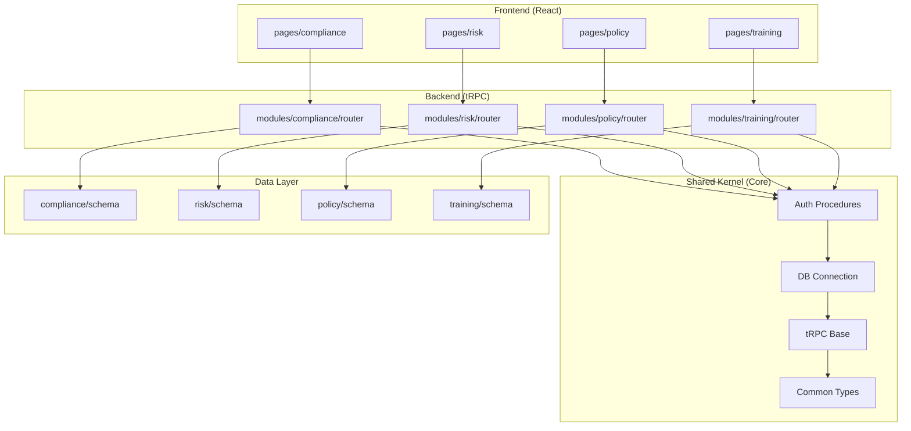
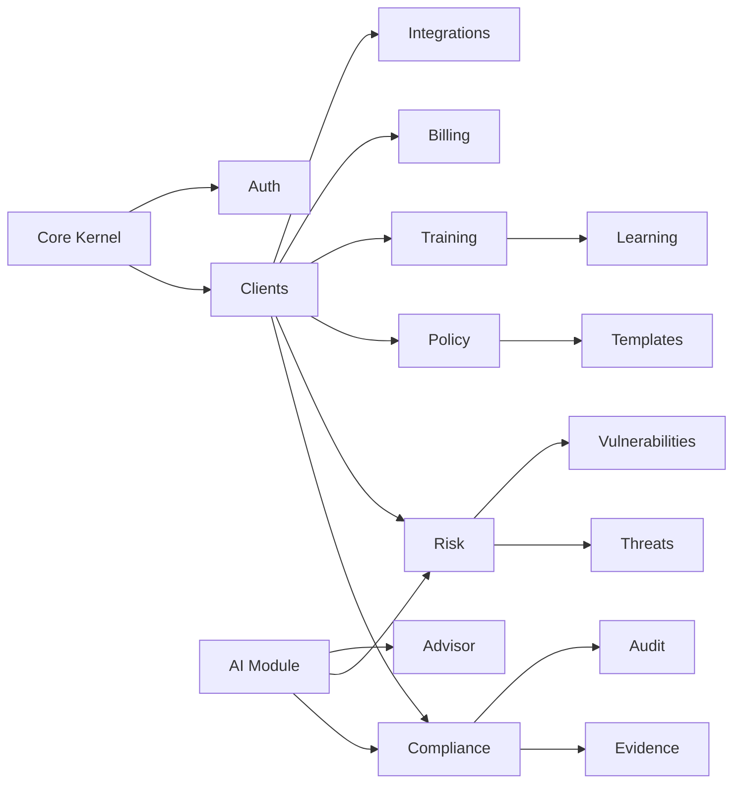

# ComplianceOS Modular Architecture Specification

**Version:** 1.0  
**Date:** 2026-03-07  
**Status:** Architectural Specification  

---

## 1. Executive Summary

This document outlines a comprehensive modularization strategy for ComplianceOS to transform its current monolithic architecture into a loosely-coupled, feature-based modular system. The goal is to enable independent development, testing, and deployment of features while minimizing the risk of changes in one module affecting others.

### Key Objectives

- **Isolation**: Changes to one feature domain should not impact others
- **Scalability**: Enable parallel development across multiple teams
- **Maintainability**: Reduce build times and simplify code navigation
- **Testability**: Individual modules can be unit tested in isolation
- **Extensibility**: Support plugin-based extensions for enterprise customization

---

## 2. Current Architecture Analysis

### 2.1 Existing Structure

```
packages/core/src/
├── server/routers/     # 90+ tRPC routers in flat structure
├── pages/              # 80+ page components + 30 subdirectories  
├── schema.ts           # Single 298KB database schema file
├── routers.ts          # 180KB+ router aggregation file
├── lib/                # Shared utilities (partial modularization: only crm/)
└── db.ts               # Centralized database connection
```

### 2.2 Identified Pain Points

| Issue | Impact |
|-------|--------|
| Single `routers.ts` | Full rebuild on any router change |
| Single `schema.ts` | Risky migrations, no feature isolation |
| Flat router directory | Unclear ownership and dependencies |
| Shared procedures | Implicit coupling between features |
| No module boundaries | Changes cascade unexpectedly |

---

## 3. Proposed Modular Architecture

### 3.1 High-Level Structure



### 3.2 Directory Structure

```
packages/core/src/
├── core/                           # SHARED KERNEL
│   ├── trpc/                       # tRPC base setup
│   │   ├── index.ts                # Base router & procedures
│   │   ├── context.ts              # Context factory
│   │   └── middleware.ts            # Auth, permissions
│   ├── db/                         # Database layer
│   │   ├── connection.ts           # Pool management
│   │   └── migrations/             # Core migrations
│   ├── auth/                       # Authentication
│   ├── types/                      # Shared TypeScript types
│   └── utils/                      # Common utilities
│
├── modules/                        # FEATURE MODULES
│   ├── compliance/
│   │   ├── index.ts                # Module exports
│   │   ├── router.ts                # tRPC router
│   │   ├── schema.ts                # Module schema
│   │   ├── services/                # Business logic
│   │   ├── pages/                   # React pages
│   │   ├── components/              # Feature components
│   │   └── hooks/                   # Custom hooks
│   │
│   ├── risk/
│   │   ├── index.ts
│   │   ├── router.ts
│   │   ├── schema.ts
│   │   ├── services/
│   │   ├── pages/
│   │   ├── components/
│   │   └── hooks/
│   │
│   ├── policy/
│   │   ├── index.ts
│   │   ├── router.ts
│   │   ├── schema.ts
│   │   ├── services/
│   │   ├── pages/
│   │   ├── components/
│   │   └── hooks/
│   │
│   ├── training/
│   │   ├── index.ts
│   │   ├── router.ts
│   │   ├── schema.ts
│   │   ├── services/
│   │   ├── pages/
│   │   ├── components/
│   │   └── hooks/
│   │
│   ├── clients/                    # Multi-tenant management
│   │   ├── index.ts
│   │   ├── router.ts
│   │   ├── schema.ts
│   │   ├── pages/
│   │   ├── components/
│   │   └── hooks/
│   │
│   ├── billing/                    # Subscription & payments
│   ├── audit/                      # Audit logging
│   ├── evidence/                   # Evidence management
│   ├── integrations/               # Third-party integrations
│   ├── ai/                          # AI/ML features
│   └── crm/                         # Existing CRM module
│       └── [already modularized]
│
├── app/                            # APPLICATION COMPOSITION
│   ├── router.ts                   # Root router (combines modules)
│   └── registry.ts                 # Module registry
│
└── components/                     # SHARED UI COMPONENTS
    ├── ui/                         # Base design system
    ├── layouts/                    # Page layouts
    └── shared/                     # Cross-module components
```

---

## 4. Module Definition & Contracts

### 4.1 Module Interface

Each feature module MUST expose:

```typescript
// modules/{module-name}/index.ts
import type { Router } from '../core/trpc';

export interface ModuleConfig {
  name: string;
  version: string;
  enabled: boolean;
  permissions: string[];
  dependencies: string[];
}

export interface Module {
  config: ModuleConfig;
  router: Router;
  schemas?: Record<string, unknown>;
}

export function createModule(config: ModuleConfig, router: Router): Module {
  return { config, router };
}
```

### 4.2 Module Router Structure

```typescript
// modules/compliance/router.ts
import { router, protectedProcedure } from '../../core/trpc';
import { z } from 'zod';
import * as service from './services/compliance';

export const complianceRouter = router({
  // Queries
  list: protectedProcedure
    .input(z.object({ clientId: z.string() }))
    .query(async ({ input, ctx }) => {
      return service.listComplianceRequirements(input.clientId);
    }),
  
  // Mutations
  create: protectedProcedure
    .input(z.object({ 
      clientId: z.string(),
      name: z.string(),
      framework: z.string()
    }))
    .mutation(async ({ input, ctx }) => {
      return service.createComplianceRequirement(input, ctx);
    }),
    
  // Sub-routers for complex features
  requirements: requirementsRouter,
  controls: controlsRouter,
  evidence: evidenceRouter,
});
```

### 4.3 Module Dependency Declaration

```typescript
// modules/risk/module.ts
import { createModule } from './router';

export const riskModule = createModule(
  {
    name: 'risk',
    version: '1.0.0',
    enabled: true,
    permissions: ['risk:read', 'risk:write', 'risk:admin'],
    dependencies: ['core', 'clients', 'compliance'],  // Explicit dependencies
  },
  riskRouter
);
```

---

## 5. Database Schema Modularization

### 5.1 Strategy

- **Per-module schema files**: Each module owns its tables
- **Explicit foreign keys**: Cross-module references use explicit IDs
- **Shared tables in core**: Users, clients, settings in core module
- **Gradual migration**: No big-bang rewrite

### 5.2 Schema File Structure

```typescript
// modules/compliance/schema.ts
import { pgTable, text, timestamp, uuid } from '../../core/db/dialect';
import { clients } from '../clients/schema';

export const complianceRequirements = pgTable('compliance_requirements', {
  id: uuid('id').primaryKey().defaultRandom(),
  clientId: uuid('client_id')
    .references(() => clients.id, { onDelete: 'cascade' })
    .notNull(),
  name: text('name').notNull(),
  framework: text('framework').notNull(),
  status: text('status').notNull().default('pending'),
  createdAt: timestamp('created_at').defaultNow().notNull(),
  updatedAt: timestamp('updated_at').defaultNow().notNull(),
});

// Type exports
export type ComplianceRequirement = typeof complianceRequirements.$inferSelect;
export type NewComplianceRequirement = typeof complianceRequirements.$inferInsert;
```

### 5.3 Cross-Module References

```typescript
// modules/risk/schema.ts - Using string IDs instead of foreign keys
import { pgTable, text, timestamp, uuid } from '../../core/db/dialect';

export const riskScenarios = pgTable('risk_scenarios', {
  id: uuid('id').primaryKey().defaultRandom(),
  // Use text for cross-module reference (not foreign key)
  clientId: text('client_id').notNull(),  // Reference to clients.id
  complianceRequirementId: text('compliance_requirement_id'),  // Optional link
  title: text('title').notNull(),
  // ... other fields
});
```

---

## 6. Frontend Feature Modules

### 6.1 Page Organization

```typescript
// modules/compliance/pages/index.tsx
export { ComplianceDashboard } from './ComplianceDashboard';
export { ComplianceRequirements } from './ComplianceRequirements';
export { ComplianceDetail } from './ComplianceDetail';

// Navigation config
export const complianceRoutes = [
  { path: '/compliance', component: ComplianceDashboard },
  { path: '/compliance/:id', component: ComplianceDetail },
];
```

### 6.2 Component Architecture

```typescript
// modules/compliance/components/RequirementCard.tsx
import { Card } from '../../../components/ui/card';
import { Badge } from '../../../components/ui/badge';

interface RequirementCardProps {
  requirement: ComplianceRequirement;
  onEdit?: (id: string) => void;
  onDelete?: (id: string) => void;
}

export function RequirementCard({ requirement, onEdit, onDelete }: RequirementCardProps) {
  return (
    <Card>
      <h3>{requirement.name}</h3>
      <Badge>{requirement.status}</Badge>
      {/* Module-specific content */}
    </Card>
  );
}
```

### 6.3 Module Hooks

```typescript
// modules/compliance/hooks/useCompliance.ts
import { trpc } from '../../../core/trpc/client';

export function useCompliance(clientId: string) {
  const requirements = trpc.compliance.list.useQuery({ clientId });
  const createMutation = trpc.compliance.create.useMutation();
  
  return {
    requirements,
    createRequirement: createMutation.mutateAsync,
  };
}
```

---

## 7. Shared Kernel (Core) Design

### 7.1 Core Responsibilities

| Component | Responsibilities |
|-----------|------------------|
| `core/trpc` | Base router, procedures (public, protected, admin), error handling |
| `core/db` | Connection pooling, query builder, migrations |
| `core/auth` | Authentication, session management, permissions |
| `core/types` | Shared types, Zod schemas, enums |
| `core/utils` | Date formatting, validation, helpers |

### 7.2 Base Procedures

```typescript
// core/trpc/index.ts
import { initTRPC, TRPCError } from '@trpc/server';
import { type Context } from './context';

const t = initTRPC.context<Context>().create();

export const router = t.router;
export const publicProcedure = t.procedure;

// Protected procedure with auth
export const protectedProcedure = t.procedure.use(async ({ ctx, next }) => {
  if (!ctx.user) {
    throw new TRPCError({ code: 'UNAUTHORIZED' });
  }
  return next({ ctx: { ...ctx, user: ctx.user } });
});

// Admin-only procedure
export const adminProcedure = protectedProcedure.use(async ({ ctx, next }) => {
  if (ctx.user.role !== 'admin') {
    throw new TRPCError({ code: 'FORBIDDEN', message: 'Admin access required' });
  }
  return next({ ctx });
});

// Module procedure - base for feature modules
export const moduleProcedure = protectedProcedure;
```

---

## 8. Module Registry & Composition

### 8.1 Module Registry

```typescript
// app/registry.ts
import type { Module } from '../core/modules';

const modules: Map<string, Module> = new Map();

// Register modules
export function registerModule(module: Module) {
  modules.set(module.config.name, module);
}

// Get module by name
export function getModule(name: string): Module | undefined {
  return modules.get(name);
}

// Get all enabled modules
export function getEnabledModules(): Module[] {
  return Array.from(modules.values())
    .filter(m => m.config.enabled);
}
```

### 8.2 Root Router Composition

```typescript
// app/router.ts
import { router } from '../core/trpc';
import { getEnabledModules } from './registry';

// Import module routers
import { complianceRouter } from '../modules/compliance/router';
import { riskRouter } from '../modules/risk/router';
import { policyRouter } from '../modules/policy/router';
import { trainingRouter } from '../modules/training/router';
import { clientsRouter } from '../modules/clients/router';

export const appRouter = router({
  // Core routers
  clients: clientsRouter,
  
  // Feature modules
  compliance: complianceRouter,
  risk: riskRouter,
  policy: policyRouter,
  training: trainingRouter,
  
  // Add new modules here
});

export type AppRouter = typeof appRouter;
```

---

## 9. Dependency Graph

### 9.1 Module Dependencies



### 9.2 Dependency Rules

1. **No circular dependencies**: Module A cannot depend on B if B depends on A
2. **Core first**: All modules depend on Core
3. **Leaf modules**: Some modules (e.g., evidence) only depend on clients + core
4. **Explicit versions**: Dependencies must specify compatible versions

---

## 10. Plugin/Extension Points

### 10.1 Extension Point Types

Based on `docs/plugins/plugin-architecture.md`:

| Extension Point | Description | Example |
|-----------------|-------------|---------|
| `router` | Add new API endpoints | Custom scanner integration |
| `schema` | Add database tables | Custom field types |
| `page` | Add new UI pages | Dashboard widgets |
| `hook` | Inject behavior | Custom validation |
| `middleware` | Add processing | Request/response transforms |

### 10.2 Plugin Interface

```typescript
// core/plugins/types.ts
export interface Plugin {
  name: string;
  version: string;
  
  // Hooks
  onInit?(context: PluginContext): Promise<void>;
  onRouterInit?(builder: RouterBuilder): void;
  onSchemaInit?(schema: SchemaBuilder): void;
  onPageRegister?(registry: PageRegistry): void;
}

export interface PluginContext {
  db: Database;
  config: AppConfig;
  logger: Logger;
}
```

---

## 11. Implementation Phases

### Phase 1: Foundation (Weeks 1-2)

- [ ] Extract Core kernel from existing code
  - [ ] Create `core/trpc` with base procedures
  - [ ] Create `core/db` with connection management
  - [ ] Create `core/types` with shared types
- [ ] Create module scaffold generator
- [ ] Set up module registry
- [ ] Update build configuration for module support

### Phase 2: Pilot Module (Weeks 3-4)

- [ ] Refactor Training/Learning module as pilot
  - [ ] Move `routers/training.ts` → `modules/training/router.ts`
  - [ ] Create `modules/training/schema.ts`
  - [ ] Move pages → `modules/training/pages/`
  - [ ] Create module index with exports
- [ ] Test isolated builds
- [ ] Verify no regression in functionality

### Phase 3: Core Modules (Weeks 5-8)

- [ ] Refactor high-impact modules:
  - [ ] Clients (tenant management)
  - [ ] Compliance
  - [ ] Risk
  - [ ] Policy
- [ ] Update root router composition
- [ ] Update frontend imports

### Phase 4: Remaining Modules (Weeks 9-12)

- [ ] Refactor remaining routers:
  - [ ] Evidence, Controls, Audit
  - [ ] Billing, Integrations
  - [ ] AI/Advisor
- [ ] Remove legacy `routers.ts`
- [ ] Update all imports

### Phase 5: Polish & Enforce (Weeks 13-14)

- [ ] Add module dependency validation
- [ ] Create module documentation
- [ ] Set up module-level testing
- [ ] Configure CI/CD for module builds

---

## 12. Migration Strategy

### 12.1 Incremental Migration

1. **Step 1**: Create new module structure alongside existing code
2. **Step 2**: Copy code to new module (no changes initially)
3. **Step 3**: Update imports to use new module
4. **Step 4**: Remove old code after verification
5. **Step 5**: Refactor for module best practices

### 12.2 Backward Compatibility

- Maintain existing API surface during migration
- Use router merging to support both old and new
- Feature flags for gradual rollout

---

## 13. Benefits & Success Metrics

### 13.1 Expected Benefits

| Metric | Current (Estimate) | Target |
|--------|-------------------|--------|
| Full build time | ~5+ min | <2 min |
| Module build time | N/A | <30 sec |
| Router file size | 180KB | <5KB per module |
| Schema file size | 298KB | <20KB per module |
| Test isolation | None | Per-module |

### 13.2 Success Criteria

- [ ] Each module can be built/tested independently
- [ ] Changes to one module don't trigger full rebuild
- [ ] Clear ownership boundaries for each module
- [ ] New developers can find code within 30 seconds
- [ ] API changes are isolated to their module

---

## 14. Appendix: Module Inventory

Based on existing `server/routers/` directory:

| Module | Routers | Priority |
|--------|---------|----------|
| clients | clients, users, onboarding | Critical |
| compliance | compliance, requirements, controls | Critical |
| risk | risks, threats, vulnerabilities | Critical |
| policy | clientPolicies, policyTemplates | High |
| training | training, learning | High |
| evidence | evidence, evidenceFiles | High |
| audit | audit, auditLogs | High |
| billing | billing, subscription | Medium |
| integrations | integrations, connectors | Medium |
| ai | ai, advisor, llm | Medium |
| frameworks | frameworks, mappings | Medium |
| workflows | workflows, automation | Medium |
| privacy | privacy, dsar | Low |
| vendors | vendorAssessments, vendorContracts | Low |

---

## 15. Next Steps

1. **Review and approve** this specification
2. **Select pilot module** (recommended: Training/Learning)
3. **Create module scaffold** template
4. **Begin Phase 1** foundation work

---

*Document Version: 1.0*  
*Architecture Owner: Technical Leadership*  
*Last Updated: 2026-03-07*
