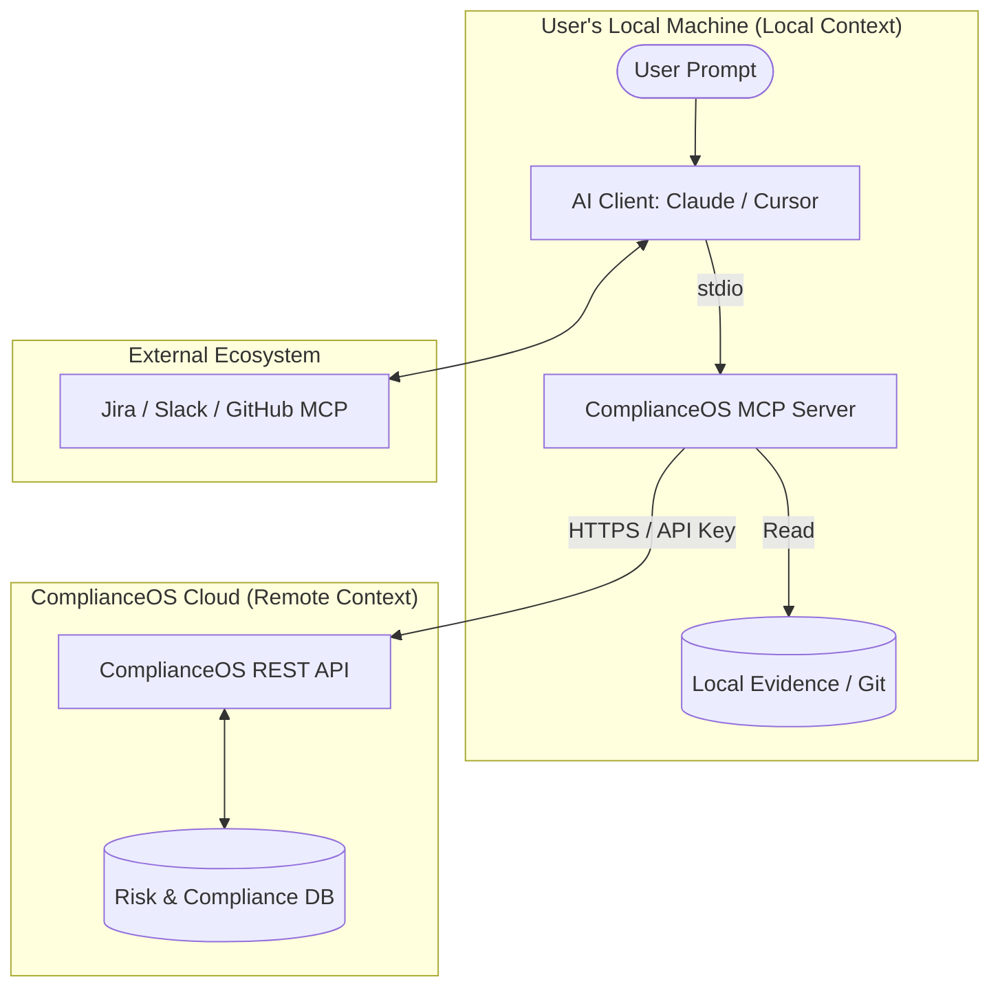

# ComplianceOS: Detailed MCP Value Proposition & Strategy

## 1. Deep-Dive: 10 Strategic Superpowers of MCP

Unlike a standard REST API or a simple chatbot, an MCP-enabled ComplianceOS offers these 10 unique capabilities:

### 1. Cross-App Orchestration (The "Universal Bridge")
**The Problem:** Currently, your AI can only see data inside ComplianceOS. It has no idea what is happening in the developer's code or the manager's emails.
**The MCP Solution:** An AI (like Claude or Cursor) can simultaneously "see" a developer's local code, the Git history, and the ComplianceOS risk register. 
*   **Result:** It can say: *"I see you just added a new database module in the code; I've automatically added a corresponding 'Data Leakage' risk to your ComplianceOS project."*

### 2. Native Multi-Model Support (Zero Lock-in)
**The Problem:** You usually have to build, maintain, and pay for complex API integrations for every LLM (OpenAI, Anthropic, Gemini) inside your own UI.
**The MCP Solution:** You build the tool interface **once** using the MCP standard. 
*   **Result:** Your users can then use **any** AI client they prefer (Claude Desktop, ChatGPT, Local Models) to manage their compliance. You provide the tools; they provide the "brain" and the GPU.

### 3. Local + Cloud Context Merger
**The Problem:** AI in the cloud can't see private, local evidence files (PDFs, internal emails, Excel sheets) unless the user manually uploads them to your server.
**The MCP Solution:** Since the MCP server runs locally (via stdio transport), it can scan a user's local folders.
*   **Result:** It can map local evidence to "Control Requirements" in the cloud-based ComplianceOS without ever moving those sensitive files to your cloud database.

### 4. Direct "Headless" Operations
**The Problem:** Users must log in, click through multiple menus, and fill out forms to perform even simple GRC tasks.
**The MCP Solution:** Users can manage compliance via CLI or specialized AI agents. 
*   **Result:** A CISO can say: *"Draft a status report for the Board using the last 3 months of audit data from ComplianceOS"*—and the AI executes this in the background while the user works in another application.

### 5. AI-Assisted "Self-Healing" Compliance
**The Problem:** Your app can flag a compliance gap, but the user still has to manually go into their system and fix it.
**The MCP Solution:** In an IDE like Cursor, the AI sees a failing compliance check in ComplianceOS and has context of the code.
*   **Result:** The AI identifies the fix and, with the user's permission, **rewrites the code or configuration** to bring the system back into compliance immediately.

### 6. Interactive "Tool" Standard (Not just Text)
**The Problem:** Chatbots just generate text summaries, which can be prone to "hallucinations" or formatting errors.
**The MCP Solution:** You expose specialized "Tools" (like CISO Assistant's 90+ tools) with strict JSON schemas. 
*   **Result:** The AI doesn't just "talk" about GRC; it invokes precise backend functions (e.g., `calculate_ebios_risk_score()`) with 100% data integrity and schema validation.

### 7. Decentralized Security (Stdio Transport)
**The Problem:** You have to manage complex API keys, CORS policies, and network firewall rules for every external AI tool.
**The MCP Solution:** The AI client launches your MCP server as a sub-process on the user's machine. 
*   **Result:** The server only talks to the ComplianceOS API using a local token. There are **no open web ports** and no exposure of the internal tool logic to the public internet.

### 8. Automation of Complex GRC Methodologies
**The Problem:** Methodologies like ISO 27001 or EBIOS RM require dozens of screens, cross-references, and manual lookups.
**The MCP Solution:** The logic of the methodology is encoded into the MCP server's tools. 
*   **Result:** A user can say: *"Start a new EBIOS RM assessment for our Cloud infrastructure,"* and the AI will systematically walk through the steps, calling the necessary backend tools automatically.

### 9. Real-time "Compliance Copilot" in the Workflow
**The Problem:** Compliance is viewed as a "later" task, done once a year or after a project is finished.
**The MCP Solution:** Compliance becomes an active, background process. 
*   **Result:** As a CISO browses their vendor list or a developer writes a feature, the AI provides real-time "Compliance Safety Checks" based on ComplianceOS policies right where they are working.

### 10. Building a Plugin Ecosystem (Future Proofing)
**The Problem:** To integrate with a new tool (like Slack or Jira), you have to write a custom, hard-coded integration.
**The MCP Solution:** Because MCP is a protocol, ComplianceOS can "talk" to every other MCP server. 
*   **Result:** You can tell your AI: *"Take the open tickets from the Jira-MCP-Server and verify them against the Control-MCP-Server in ComplianceOS."* You get a whole ecosystem of features for free through the AI orchestrator.

---

## 2. Visual Architecture

---

## 3. Implementation Roadmap & Next Steps

### Current Best Path: Node.js/TypeScript
*   **Shared Logic:** We can reuse our existing Zod schemas and API types.
*   **Deployment:** We can bundle it as an NPM package that users run via `npx`.

### Immediate Actions:
1.  **Select the "Pilot" Tools:** Pick 5 high-impact tools (e.g., `list_projects`, `get_compliance_status`, `add_risk_scenario`).
2.  **Define Authentication:** Create a dedicated "MCP PAT" (Personal Access Token) system in ComplianceOS.
3.  **Security Audit:** Ensure the MCP tools respect multi-tenancy and workspace boundaries.
